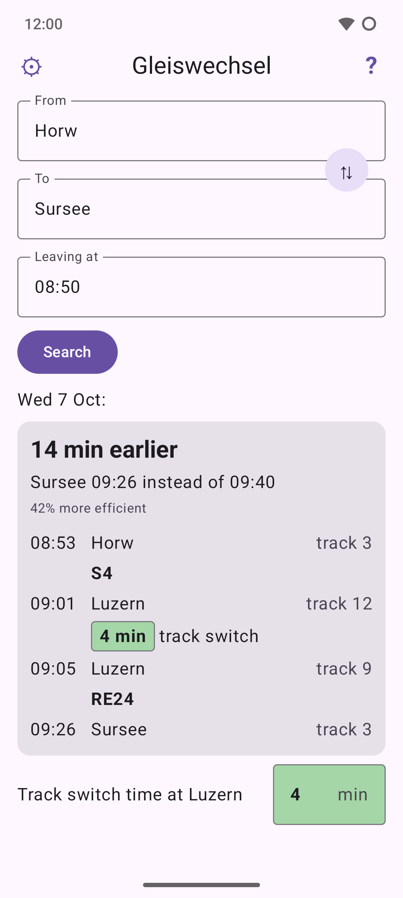

# Gleiswechsel

**Schneller umsteigen.** An Android app for Swiss commuters: it checks whether your daily train
trip has a faster connection than the official timetable shows.



## Install

Download the APK from [Releases](https://github.com/buerlino/gleiswechsel/releases), or add
`https://github.com/buerlino/gleiswechsel` to [Obtainium](https://github.com/ImranR98/Obtainium)
to get updates. Soon on F-Droid. Android 8 or newer.

## The idea

The official planners only show a change of trains if it takes at least the station's official
track switch time. At big stations that's generous: at Zürich HB the SBB app won't offer a train
that leaves less than about 7 minutes after you arrive, even if it's on the same platform. Many
commuters know they make such changes every day.

Gleiswechsel takes your own track switch time instead and looks for connections the official
planner left out. Later it will also tell you how often such a change worked in the past.
5 minutes a day add up to hours a year. And if your connection is already the best one, it tells
you that too.

Background and sources: [research/](research/).

## Data

Swiss public transport open data: [transport.opendata.ch](https://transport.opendata.ch/) for
the connections; from [opentransportdata.swiss](https://opentransportdata.swiss/) the official
track switch time at each station (the national timetable), and later the actual arrival and
departure times published daily, for how reliable a change is.

## Privacy

No account, no ads, no tracking. Your commutes stay on your phone. Permissions: `INTERNET`.

## Build

Native Android, Kotlin + Jetpack Compose. Needs the Android SDK; Gradle runs on JDK 21.

```
./gradlew :core:test :app:assembleRelease
```

## License

GPLv3, see [LICENSE](LICENSE). Gleiswechsel is not made by or affiliated with SBB or any other
transport company. Timetable data: opentransportdata.swiss.
